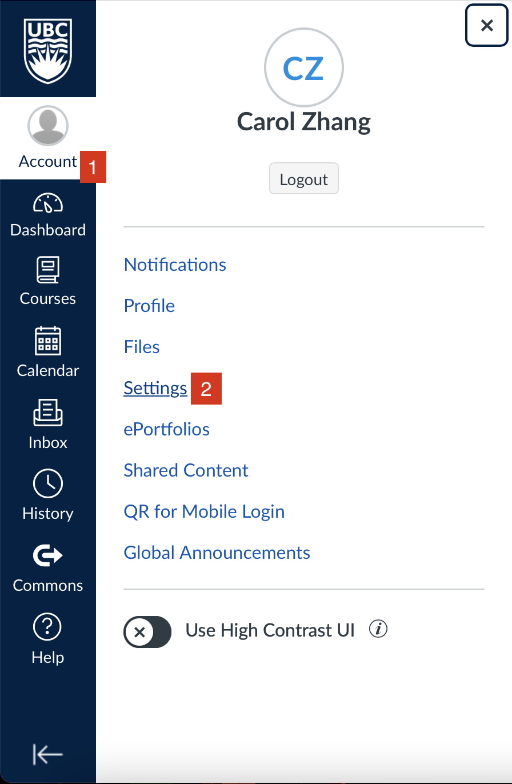
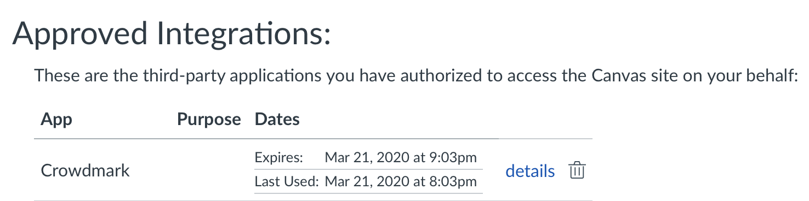
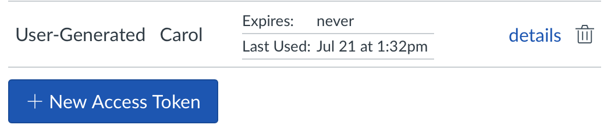
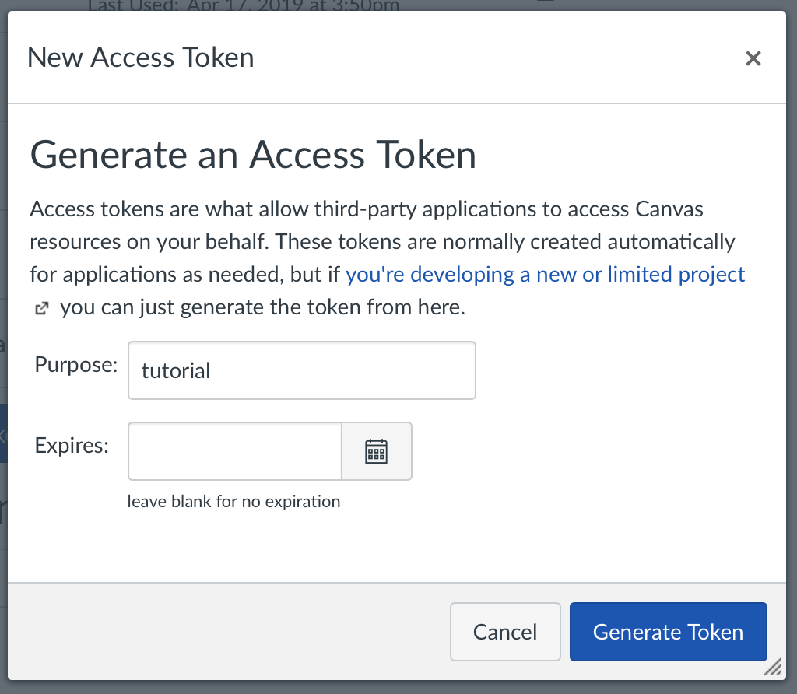
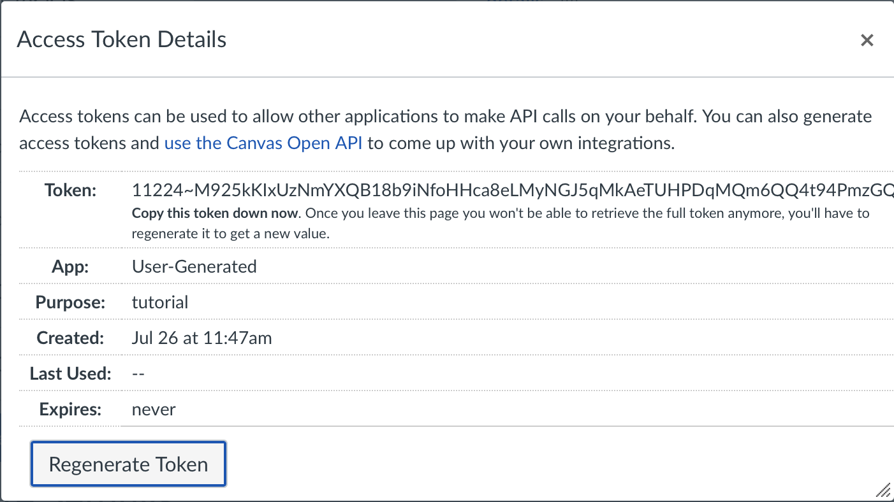

---
jupytext:
  formats: ipynb,md:myst
  text_representation:
    extension: .md
    format_name: myst
    format_version: 0.13
    jupytext_version: 1.10.3
kernelspec:
  display_name: Python 3
  language: python
  name: python3
---

# Getting the Canvas API token
Your Canvas API token is used to send your quizzes to Canvas.

+++

## Step 1: Go to user settings
<!--  -->

## Step 2: Scroll down to `Approved Integrations` section of page
<!--  -->

## Step 3: Click on `+ New Access Token`
<!--  -->

## Step 4: Give your token an appropriate name, don't set an expiry date and hit `Generate Token`
<!--  -->
  

- a pop-up looking like this should come up:
<!--  -->

## Step 5: copy all of the text in `Token:` and paste it into the local `token.yaml` file and you're done!  
  
Credit: https://github.com/phaustin/eoas-wl/tree/main/canvas-api
