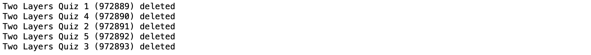
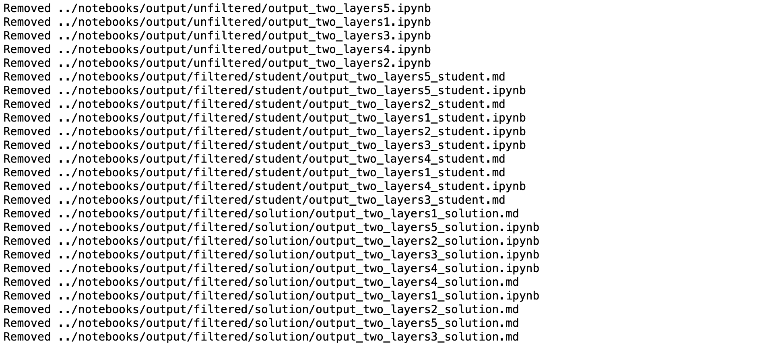
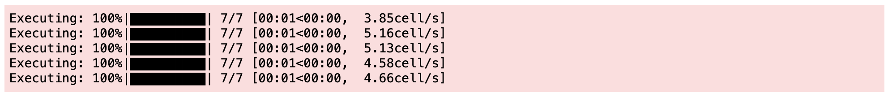
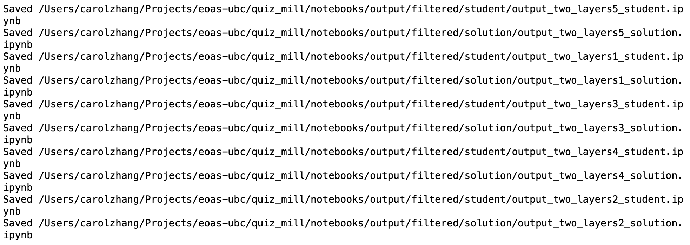
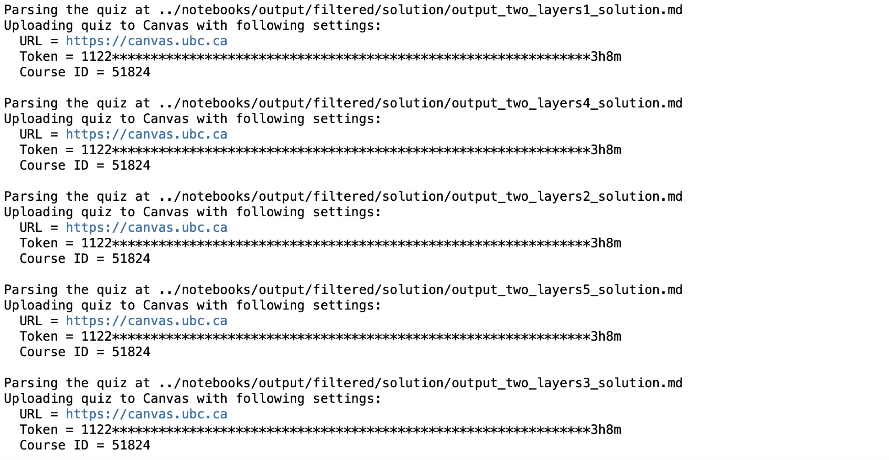
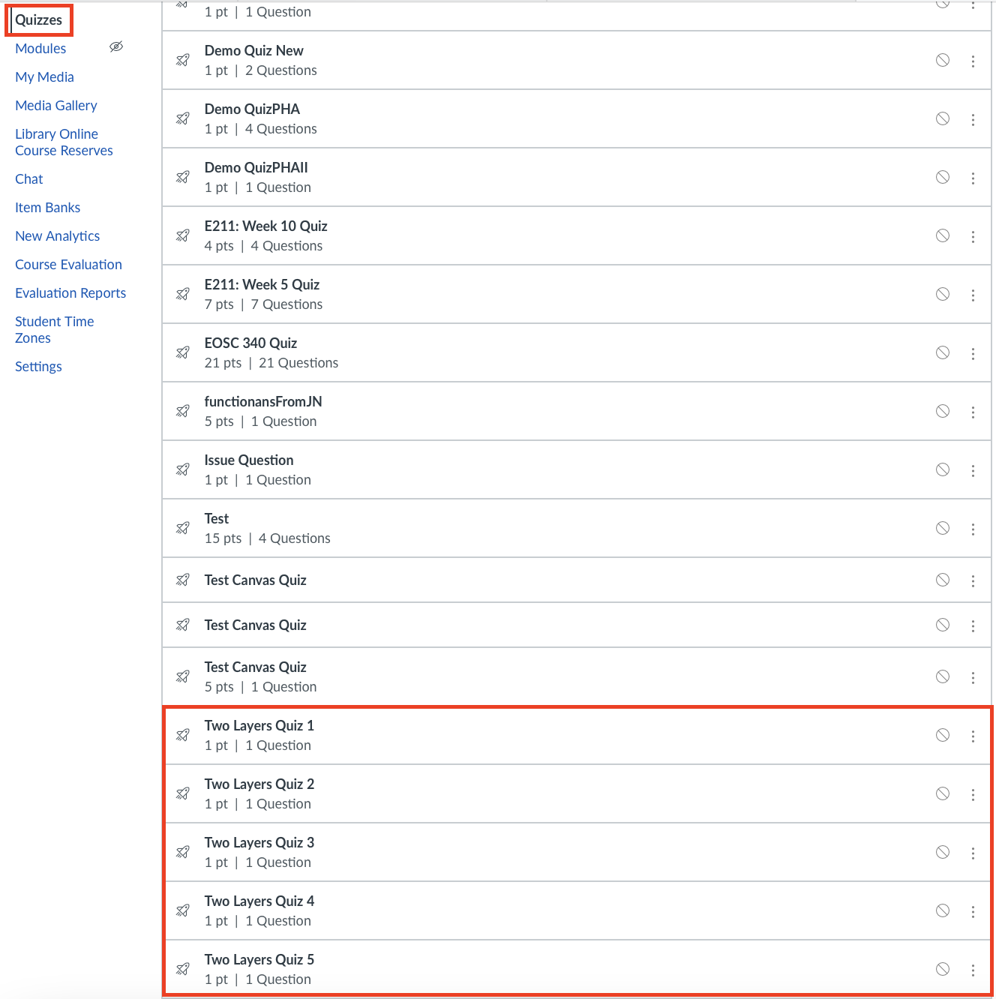

---
jupytext:
  text_representation:
    extension: .md
    format_name: myst
    format_version: 0.13
    jupytext_version: 1.10.3
kernelspec:
  display_name: quiz-mill
  language: python
  name: quiz-mill
---

# Convert Jupyter notebooks to Canvas quizzes
This guide shows you how you go from Jupyter notebooks to generating multiple quizzes and sending them to Canvas. The following steps allow you to run the commands in the notebook (on a JupyterHub), but simply copy and paste the commands in your terminal if running on your local machine.
***
## Prerequisites:
- Must have the Canvas API token
- Must have the base notebook

## Step 1: Remove any old "Two Layers" quizzes from Canvas (if applicable)
Run the following cell:

```{code-cell} ipython3
%%bash
remove -v ../
```

### Output should be similar to the following:


+++

## Step 2: Remove any old notebooks from `output/` folder (if applicable)
Run the following cell:

```{code-cell} ipython3
%%bash
clean -v
```

### Output should be similar to the following:


+++

## Step 3: Generate **N** notebooks with random parameters
Run the following cell:

```{code-cell} ipython3
%%bash
N=5 # change number of notebooks here
generate -n $N notebooks/
```

### Expected output:


### What the notebook should look like:
See an example [here](ex_two_layers.md).  
The notebooks are located at `quiz_mill/notebooks/output/unfiltered/`.

+++

## Step 4: Filter notebooks into student and solution notebook versions
Run the following cell:

```{code-cell} ipython3
%%bash
filter -v notebooks/output
```

### Expected output:


### Student notebook:
See [here](ex_output_two_layers1_student.md) for an example student notebook.

### Solution notebook:
See [here](ex_output_two_layers1_solution.md) for an example solution notebook.

+++

### Step 5: Send solution notebooks as quizzes to Canvas
Run the following cell (cell takes some time to run):

```{code-cell} ipython3
%%bash
send -c 51824 -v notebooks/output/filtered/solution/
```

### Expected output:


### What you should see on Canvas:


+++

See the [reference](reference.ipynb) guide for full details of commands and options.
