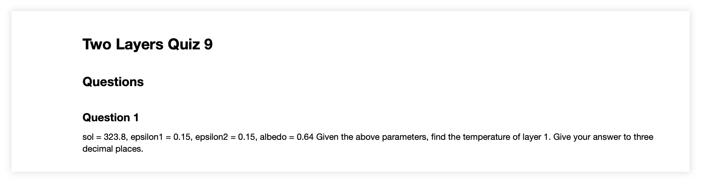
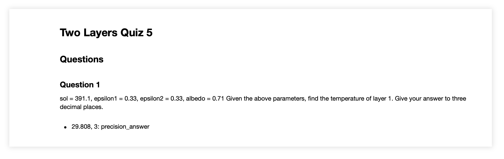

---
jupytext:
  text_representation:
    extension: .md
    format_name: myst
    format_version: 0.13
    jupytext_version: 1.10.3
kernelspec:
  display_name: Python 3
  language: python
  name: python3
---

# Filter Notebook

+++

Note: currently only works for Two Layers quizzes.

This script takes in a directory path containing "unfiltered" notebooks and outputs "filtered" student and solution notebooks. "Unfiltered" notebooks do not contain metadata associated with questions, answers, and parameters. "Filtered" student notebooks only contains questions, while the solution notebooks contains questions and answers. Both types of "filtered" notebooks contain specific metadata, allowing us to use the **md2canvas** command to upload our notebooks as quizzes to canvas.

+++

## How the script works

+++

### Import libraries

+++

```
import os
import jupytext as jp
from jupytext.cli import jupytext
from pathlib import Path
from nbformat.v4.nbbase import new_markdown_cell
import click
import re
from .solve_layers import do_two_matrix
```

+++

### Helper functions

+++

#### Add quiz metadata
Adds metadata to indicate that our notebook is a quiz. We are also able to customize quiz options.

+++

```
def add_quiz_metadata(quiz_num=1, title="Two Layers Quiz", allowed_attempts=3, scoring_policy="keep_highest", cant_go_back=False, shuffle_answers=False):
    quiz = new_markdown_cell(source=f"# {title} {quiz_num}")
    quiz["metadata"]["ctype"] = "quiz"
    quiz["metadata"]["title"] = f"{title} {quiz_num}"
    quiz["metadata"]["allowed_attempts"] = allowed_attempts
    quiz["metadata"]["scoring_policy"] = scoring_policy
    quiz["metadata"]["cant_go_back"] = cant_go_back
    quiz["metadata"]["shuffle_answers"] = shuffle_answers
    return quiz
```

+++

#### Add group metadata
Indicates the start of the quiz questions.

+++

```
def add_group_metadata():
    group = new_markdown_cell(source="## Questions")
    group["metadata"]["ctype"] = "group"
    group["metadata"]["name"] = "general"
    return group
```

+++

#### Get injected parameters
Each unfiltered notebook contains injected random parameters (from generate_notebooks.py). This function parses the values from the notebook to get the answer for our questions.

Note: specific to Two Layers quizzes.

+++

```
def get_injected_parameters(nb):
    for _, the_cell in enumerate(nb['cells']):
        if (
                    len(the_cell["metadata"]["tags"]) > 0 and 
                    the_cell["metadata"]["tags"][0] == "injected-parameters"
                    ):
            parameters = list(the_cell["source"].split('\n')[1:-1])
            sol = float(re.sub("^sol = ", "", parameters[0]))
            epsilon1 = float(re.sub("^epsilon1 = ", "", parameters[1]))
            epsilon2 = float(re.sub("^epsilon2 = ", "", parameters[2]))
            albedo = float(re.sub("^albedo = ", "", parameters[3]))
            break
    return sol,epsilon1,epsilon2,albedo
```

+++

#### Add questions cells
Creates a question cell containing the appropriate metadata.

Note: specific to Two Layers quizzes.

+++

```
def add_question_cells(sol, epsilon1, epsilon2, albedo):
    source = f"""\
### Question 1
sol = {sol}, epsilon1 = {epsilon1}, epsilon2 = {epsilon2}, albedo = {albedo}
Given the above parameters, find the temperature of layer 1.
Give your answer to three decimal places.\
"""
    question = new_markdown_cell(source=source)
    question["metadata"]["quesnum"]='1'
    question["metadata"]["ctype"]='question'
    question["metadata"]["question_type"] = "numerical_question"
    return question
```

+++

#### Get layer 1 answer
Creates an answer cell containing the temperature of layer 1.

+++

```
def get_layer_1_ans(sol, epsilon1, epsilon2, albedo):
    T1 = do_two_matrix(sol, albedo, epsilon1, epsilon2)[1]
    source = "* {:0.3f}, 3: precision_answer".format(T1)
    answer0 = new_markdown_cell(source=source)
    answer0['metadata']['quesnum'] = '1'
    answer0['metadata']['ctype']='answer'
    return answer0
```

+++

#### Save student notebook
Saves student notebook to user-inputted folder.

+++

```
def save_student_notebook(out_folder, in_file, nb, new_cells, verbose):
    nb['cells'] = new_cells
    out_file = out_folder / "student" / f"{in_file[:-6]}_student"
    out_file = out_file.with_suffix('.md')
    jp.write(nb,out_file,fmt='md:myst')
    out_file = out_file.with_suffix('.ipynb')
    jp.write(nb,out_file)
```

+++

#### Save solution notebook
Saves solution notebook to user-inputted folder.

+++

```
def save_solution_notebook(out_folder, in_file, nb, new_cells, verbose):
    nb['cells'] = new_cells
    out_file = out_folder / "solution" / f"{in_file[:-6]}_solution"
    print(out_file)
    out_file = out_file.with_suffix('.md')
    jp.write(nb,out_file,fmt='md:myst')
    out_file = out_file.with_suffix('.ipynb')
    jp.write(nb,out_file)
```

+++

### Main function
How it works:
1. Check if user-inputted directories exist. If yes, continue. Else, return.
2. Get an "unfiltered" notebook from user-inputted directory
3. Add appropriate metadata
4. Add questions and save "filtered" student notebook
5. Add solutions and save "filtered" solution notebook
6. Repeat from step 2 until all "unfiltered" notebooks are "filtered"

+++

```
@click.command()
@click.argument("path", type=str, nargs=1)
@click.option("-v", "--verbose", is_flag=True, default=False)
def main(path, verbose):
    path = Path(path).resolve()
    in_folder = path / "unfiltered"
    out_folder = path / "filtered"

    # Return if directory does not exists
    if not in_folder.is_dir() or not out_folder.is_dir():
        print('One or more inputted directory paths does not exist.')
        return

    # Iterate through each unfiltered notebook and filter it
    for _, _, files in os.walk(in_folder, topdown=False):

        quiz_num = 1
        
        for in_file in files:
            nb = jp.read(in_folder / in_file)

            new_cells = []

            # Add quiz metadata
            quiz = add_quiz_metadata(quiz_num, title="Two Layers Quiz", allowed_attempts=3, scoring_policy="keep_highest", cant_go_back=False, shuffle_answers=False)
            new_cells.append(quiz)
            quiz_num += 1

            # Add group metadata
            group = add_group_metadata()
            new_cells.append(group)

            # Get parameters
            sol, epsilon1, epsilon2, albedo = get_injected_parameters(nb)

            # Add question cells
            question = add_question_cells(sol, epsilon1, epsilon2, albedo)
            new_cells.append(question)

            # Save student notebook
            save_student_notebook(out_folder, in_file, nb, new_cells, verbose)

            # Add solutions
            answer0 = get_layer_1_ans(sol, epsilon1, epsilon2, albedo)
            new_cells.append(answer0)
            
            # Save solution notebook
            save_solution_notebook(out_folder, in_file, nb, new_cells, verbose)

if __name__ == "__main__":
    main()
```

+++

## Sample outputs
### Student notebook

### Solution notebook

