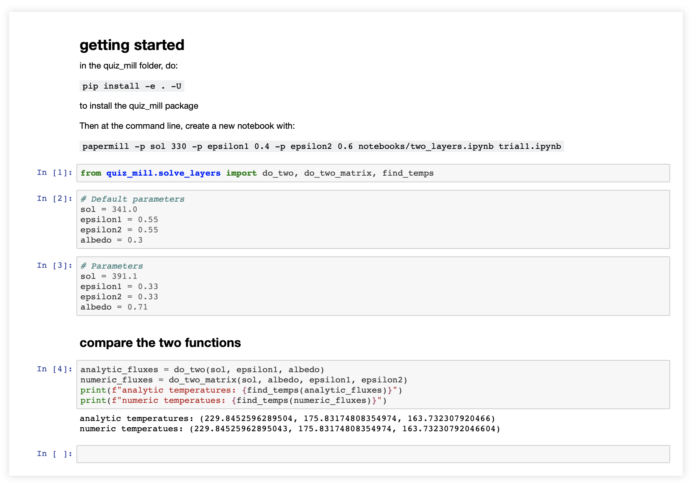

---
jupytext:
  text_representation:
    extension: .md
    format_name: myst
    format_version: 0.13
    jupytext_version: 1.10.3
kernelspec:
  display_name: Python 3
  language: python
  name: python3
---

# Generate Notebooks
Script to generate notebooks with random parameters. (Specific to Two Layers quizzes)

+++

## How the script works

+++

Preconditions: 
1. **two_layers.ipynb** is in **output/** folder.
2. **notebooks/output/unfiltered/** folder exists.

+++

### Import libraries

+++

```
import papermill as pm
import random
import click
from pathlib import Path
```

+++

### Main function
How it works:
1. Verify path exists
2. Generate random parameters
3. Inject the random parameters into a new notebook using papermill library

+++

```
@click.command()
@click.argument("path", type=str, nargs=1)
@click.option("-n", "--number")
def main(path, number):
    path = Path(path).resolve()
    if not path.is_dir():
        print("Directory path does not exist.")
        return

    for i in range(int(number)):
        sol =       round(random.uniform(0.0, 500.0), 1)
        epsilon1 =  round(random.uniform(0.0, 1.0), 2)
        epsilon1 =  round(random.uniform(0.0, 1.0), 2)
        albedo =    round(random.uniform(0.0, 1.0), 2)

        pm.execute_notebook(
            path / "two_layers.ipynb",
            path / "output/unfiltered/output_two_layers{}.ipynb".format(i+1),
            parameters=dict(sol=sol, epsilon1=epsilon1, epsilon2=epsilon1, albedo=albedo)
        )
```

+++

## Sample output
Example of a notebook generated by this script.

