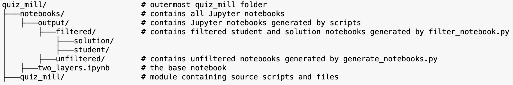

---
jupytext:
  text_representation:
    extension: .md
    format_name: myst
    format_version: 0.13
    jupytext_version: 1.10.3
kernelspec:
  display_name: Python 3
  language: python
  name: python3
---

# Project file structure
Many scripts and commands require a specific file structure to run properly. The below diagram shows what the project file structure should look like (only folders that are required by scripts and commands are shown).

