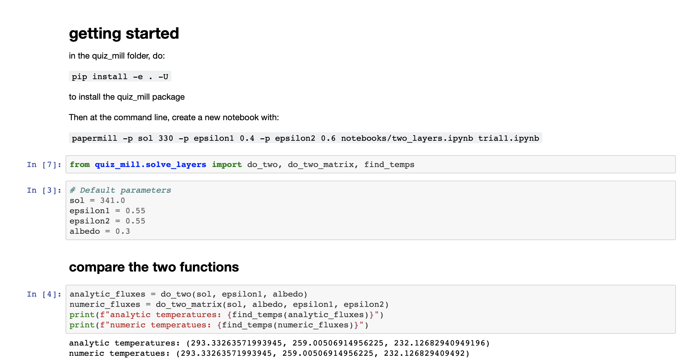

---
jupytext:
  text_representation:
    extension: .md
    format_name: myst
    format_version: 0.13
    jupytext_version: 1.10.3
kernelspec:
  display_name: Python 3
  language: python
  name: python3
---

# Workflow

+++

## Skip the details
Specify the number of quizzes you would like the generate and run the cell below. Note: cell takes some time to run.

```{code-cell} ipython3
%%bash
NUM=5
sh do_all.sh $NUM
```

### Expected Output
Specified number of quizzes should be under Quizzes section in Andrew & Harlan Sandbox.


+++

## The details

### Setup

#### Obtain a Canvas API token
See step 1 of [this Canvas API tutorial](canvas_api.ipynb) and place ```token.yaml``` file in outer ```quiz_mill/``` directory.

#### The base notebook
This is the notebook that all generated notebooks will be based off of. All scripts currently specifically tailored to **two_layers.ipynb**.



+++

### Steps
#### 1. Remove all Two Layers quizzes from Canvas

```{code-cell} ipython3
%%bash
python ../quiz_mill/remove_quizzes.py
```

Read more [here](remove_quizzes.ipynb).   

#### 2. Remove all files from output/ folder

```{code-cell} ipython3
%%bash
find ../notebooks/output/ -type f -exec rm -v {} \;
```

#### 3. Generate *n* notebooks with random parameters
The below command generates 10 notebooks with random parameters.  

```{code-cell} ipython3
%%bash
NUM=10
python ../quiz_mill/generate_notebooks.py -n $NUM
```

Read more [here](generate_notebooks.ipynb).

#### 4. Filter notebooks into student and solution notebooks

```{code-cell} ipython3
%%bash
filter-notebook ../notebooks/output/unfiltered/ ../notebooks/output/filtered/
```

Read more [here](filter_notebook.md).
#### 5. Send filtered solution notebooks as quizzes to Canvas

```{code-cell} ipython3
%%bash
sh ../quiz_mill/send_to_canvas.sh
```

Note: requires Canvas API token to run.

Read more [here](send_to_canvas.md).
