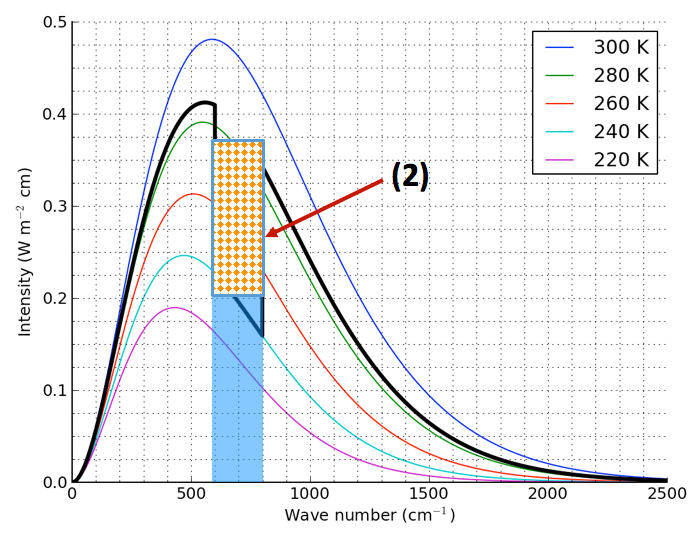
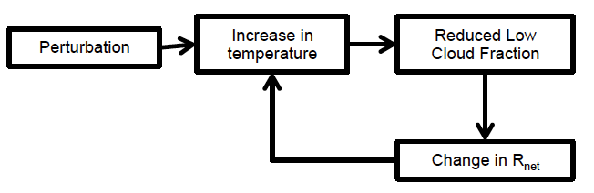
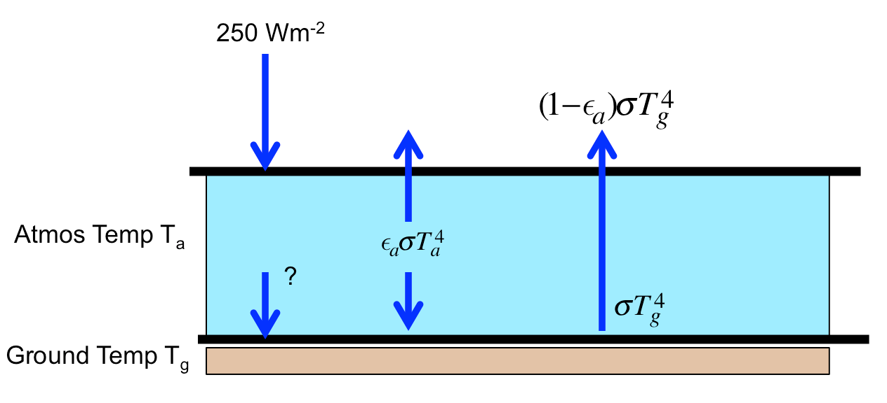
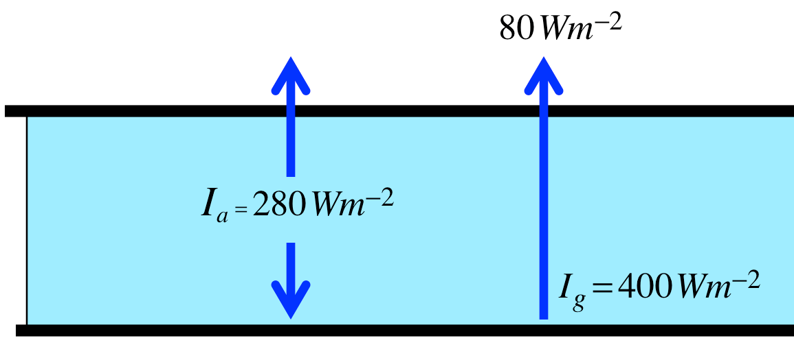
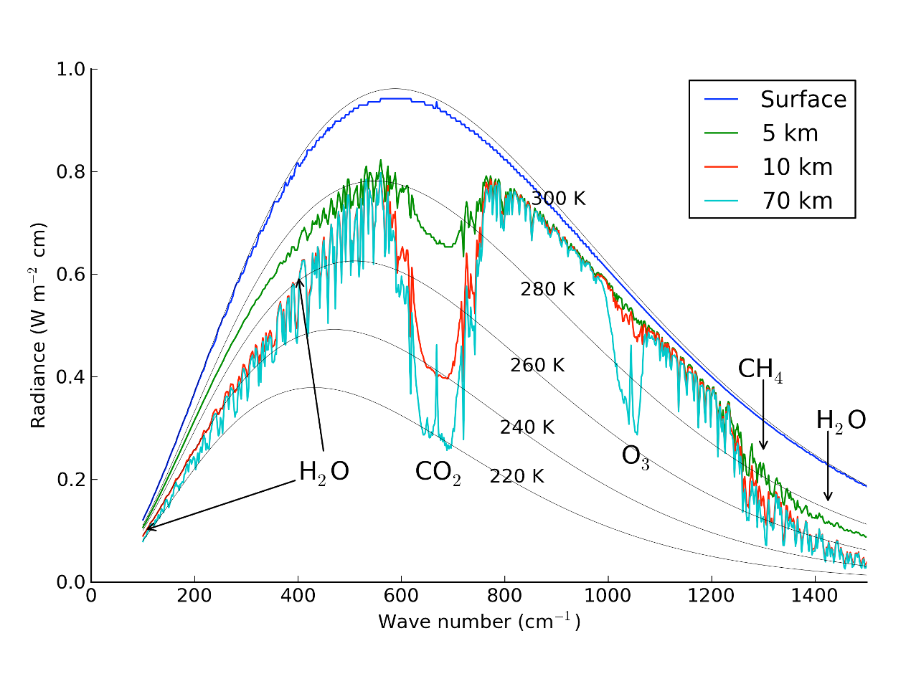

+++ {"allowed_attempts": 2, "cant_go_back": false, "ctype": "quiz", "scoring_policy": "keep_highest", "shuffle_answers": false, "title": "Quiz 2"}

# Quiz 2

## Equation Sheet  
 
Layer energy equation:  $\frac{d E}{d t}=I_{\downarrow}+I_{\uparrow}$  
 
Solar constant  $S=\frac{S_{0}}{4}(1-\alpha)$  
 
Total grey-body flux:  $I=\varepsilon \sigma T^{4}$  
 
*where*  $\sigma=5.67 \times 10^{-8} \mathrm{Wm}^{-2} \mathrm{K}^{-4}$  
 
Transmissivity tr: $I_{\text {transmitted }}=\mathrm{tr}I_{0}$  
 
Reflectivity α:  $I_{\text {reflected }}=\alpha I_{0}$  
 
Absorptivity abs:  $I_{\text{absorbed }} = \text{abs} I_{0}$  
 
Conservation of energy:  $\alpha \mathrm{I}_{0}+ \text{abs} \mathrm{I}_{0}+\mathrm{trI}_{0}=\mathrm{I}_{0}$  
 
Kirchoff's law: $\epsilon=\text{abs}$  

$CO_2$ radiative forcing: $\Delta F \ (W\, m^{-2})=  3.8  \ln \left ( \frac{CO_{2new}}{CO_{2old}}\right)/ \ln(2)$


$ \text{moist static energy:}~~~  h _ { m } = c _ { p } T + l _ { v } w _ { v } + g z$

$\text{moist adiabatic lapse rate:}~~~\Gamma = \frac { d T } { d z } = \frac { - g } { c _ { p } + l _ { v } \frac { d w _ { v } } { d T } }$


**Quiz 2 constants**:

\begin{align}
&\text{1 ppm = 2.1 Gtonnes Carbon = 7.6 Gtonnes $CO_2$}\\
\sigma  &= 5.67 \times 10 ^ { - 8 } \mathrm { Wm } ^ { - 2 } \mathrm { K } ^ { - 4 }\\
c_p  &= 1004\ J\,kg^{-1}\,K^{-1} \\
c_w  &= 4186\ J\,kg^{-1}\,K^{-1} \\
\rho_w &= 1000\ kg\,m^{-3}\\
l_v &= 2.5 \times 10^6\ J\,kg^{-1}
\end{align}

+++ {"ctype": "group", "name": "general"}

## Questions

+++ {"ctype": "question", "quesnum": 1, "question_type": "multiple_choice_question"}

Imagine we end up burning the rest of the available coal (2800 Gton carbon) **and** the oil and natural gas (200 Gton carbon), but we don’t burn any other fossil carbon. What will the atmospheric concentration of $CO_2$ be when we’re finished? Assume we burn everything instantaneously, that all of the emitted carbon stays in the atmosphere, and that today’s atmospheric $CO_2$ concentration is 400 ppm.

* about 580 ppm  
* about 640 ppm  
* about 1050 ppm  
* about 1200 ppm  
* about 1830 ppm

+++ {"ctype": "answer", "quesnum": 1}

* False
* False
* False
* False
* True

+++ {"ctype": "answer", "quesnum": 1}

We know that there are 2.1 Gigatonnes per ppm so divide by this to find increase:

+++ {"ctype": "answer", "quesnum": 1}

Check this with Python:

```{code-cell} ipython3
:ctype: answer
:quesnum: 1

new_concentration = 3000/2.1 + 400.m
print(f"{new_concentration=:5.1f} ppm")
```

+++ {"ctype": "question", "quesnum": 2, "question_type": "multiple_choice_question"}

For the figure below, pick the most accurate description of the rectangular region labeled (2).  Assume the instrument is looking down from the top of this atmosphere

 

* The radiation emitted by the gas that reaches the top of the atmosphere  
* The radiation absorbed by the gas  
* The greenhouse effect from the gas in this wavenumber range  
* The surface radiation absorbed by the gas  gas  
* The radiation emitted by the gas that reaches the surface

+++ {"ctype": "answer", "quesnum": 2}

* False
* False
* True
* False
* False

```{raw-cell}
:ctype: answer
:quesnum: 2

This is top - bottom = greenhouse effect.
```

+++ {"ctype": "question", "quesnum": 3, "question_type": "multiple_choice_question"}

For this feedback loop:

 -

  Choose the best characterization, keeping in mind that feedbacks work in both directions.  ($R_{net}$ is the net downward radiation at the top of the atmosphere)

* Amplifying because increasing low clouds heat the surface through longwave emission  
* Stabilizing because increasing low clouds reduce the surface heat flux  
* Amplifying because increasing low clouds reflect more incoming shortwave  
* Amplifying because increasing low clouds increase atmospheric mixing  
* Stabilizing because increasing low clouds emit more radiation to space

+++ {"ctype": "answer", "quesnum": 3}

* False
* False
* True
* False
* False

+++ {"ctype": "answer", "quesnum": 3}

Amplifying: if an increase in temperature reduces cloud fraction, and increasing clouds reflect more incoming shortwave then decreasing clouds must reflect less, so the loops heats and amplify.

In the same way, if the perturbation was cooling, the the clouds would increase, amplifying the cooling

+++ {"ctype": "question", "quesnum": 4, "question_type": "multiple_choice_question"}

Consider the following shallow, nocturnal atmospheric layer with emissivity **$ε_a$=0.8** over ground with emissivity of ε=1. If the ground temperature $T_g$ is 300 K and the air temperature $T_a$ is 260 K, what is the heating/cooling rate **of the ground** in $W\,m^{-2}$?

**(Note 250 $W\,m^{-2}$ in longwave flux is entering the layer from above)**

**Shortcut:  $\sigma \times 300^4 = 460\ W\,m\,^2$**

      
 
   
      
* -251 $W\,m^{-2}$  
* -202 $W\,m^{-2}$  
* +101 $W\,m^{-2}$  
* +202 $W\,m^{-2}$  
* +251 $W\,m^{-2}$

+++ {"ctype": "answer", "quesnum": 4}

* False
* True
* False
* False
* False

+++ {"ctype": "answer", "quesnum": 4}

The first term is 250*transmission, the second is $\epsilon \sigma T_a^4$ and the third is $\sigma T_g^4$ -- with the upward flux negative and downward positive, this gives -202 $W/m^2$

+++ {"ctype": "answer", "quesnum": 4}

Check this with Python:

```{code-cell} ipython3
:ctype: answer
:quesnum: 1

sigma = 5.67e-8
250*(1 - 0.8) + 0.8*sigma*260**4. - 460.  #B
```

+++ {"ctype": "question", "quesnum": 5, "question_type": "multiple_choice_question"}

Given the fluxes in the following figure, the Greenhouse effect of this atmosphere is

   
  
* 20 $W\,m^{-2}$  
* 40 $W\,m^{-2}$  
* 120 $W\,m^{-2}$  
* 320 $W\,m^{-2}$  
* 400 $W\,m^{-2}$

+++ {"ctype": "answer", "quesnum": 5}

* False
* True
* False
* False
* False

+++ {"ctype": "answer", "quesnum": 5}

40 W/m^2  -- top - bottom is +40 W/m^2

+++ {"ctype": "answer", "quesnum": 5}

Check this with Python:

```{code-cell} ipython3
:ctype: answer
:quesnum: 1

(-280 - 80) - (-400)  #B
```

+++ {"ctype": "question", "quesnum": 6, "question_type": "multiple_choice_question"}

Moist air on the western side of a mountain  has a temperature of 280 K and a vapor mixing ratio of 15 g/kg.   If it removes 5 g/kg during ascent from sea-level to 3 km, what will the temperature change $\Delta T$  be when it descends back to sea-level on the east side of the mountain?

* -15 K  
* -10 K  
* 0 K  
* 10 K  
* 15 K

+++ {"ctype": "answer", "quesnum": 6}

* False
* False
* False
* False
* True

+++ {"ctype": "answer", "quesnum": 6}

The moist static energy can't change, so if we write after - before as $\Delta$ then:

$$
\begin{align}
\Delta h_m &= 0 = c_p \Delta T + l_v \Delta w_v\\
\Delta T &= -\frac{l_v \Delta w_v}{c_p}
\end{align}
$$

which is 15 K

+++ {"ctype": "answer", "quesnum": 6}

Check this with Python:

```{code-cell} ipython3
:ctype: answer
:quesnum: 6

temp=280
cp = 1004.
lv=2.5e6
delta_wv = -5.e-3
delta_temp = -lv*delta_wv/cp
print(f"{delta_temp=:5.1f} K")
print(f"{this is halfway between 10 K and 15 K, so either D or E count})
```

+++ {"ctype": "question", "quesnum": 7, "question_type": "multiple_choice_question"}

Based on the figure below, what would an aircraft flying at 70 km estimate for the temperature of the ocean surface?


* 220 K  
* 240 K  
* 275 K  
* 295 K  
* 305 K

+++ {"ctype": "answer", "quesnum": 7}

* False  
* False
* False
* True  
* False

+++ {"ctype": "answer", "quesnum": 7}

295 K -- looking through the atmospheric window at 900 $cm^{-1}$ the brightness temperature is between
290 and 300 K.  Since we know the ocean is black in the longwave, that is the ocean surface temperature.

+++ {"ctype": "question", "quesnum": 8, "question_type": "multiple_choice_question"}

For the same figure, what is your best estimate of the air temperature at 5 km?

* 220 K  
* 240 K  
* 275 K  
* 295 K  
* 305 K

+++ {"ctype": "answer", "quesnum": 8}

* False
* False  
* True  
* False
* False

+++ {"ctype": "answer", "quesnum": 8}

Answer C) 275 K 
In the CO2 band we can see that there are 4 temperature lines, with the surface coldest, so 5 km above the surface
is the next coldest.  It is showing a brightness temperature between 270 K and 280 K and since we
know CO2 is black at 666 $cm^{-1}$ that must be the actual temperature of the surrounding air.

+++ {"ctype": "question", "quesnum": 9, "question_type": "multiple_choice_question"}

Q9)  Given a solar constant of 1100 $W/m^2$, find the change in the equlibrium surface
temperature for a planet with no atmosphere if its shortwave albedo drops from $\alpha=0.7$ to $\alpha=0.5$.  Assume the surface is black in the longwave, and that it rotates once every 24 hours so that over time the radiative flux is spread evenly over
all longitudes.

* -15 K  
* -10 K  
* +10 K  
* +15 K  
* +25 K

+++ {"ctype": "answer", "quesnum": 9}

* False  
* False  
* False
* False  
* True

+++ {"ctype": "answer", "quesnum": 9}

Answer E) + 25 K.  We can rule out negative temperature drops since the albedo is decreasing so the downward flux
$I reaching the surface must be increasing. For a black surface the equations are:

$I = S_0(1 - \alpha)/4.$ and $I = \sigma T^4$.

+++ {"ctype": "answer", "quesnum": 9}

Check this with Python:

```{code-cell} ipython3
:ctype: answer
:quesnum: 9

S0=1100
sigma = 5.67e-8
alpha_before = 0.7
alpha_after = 0.5
I_before = S0/4.*(1-alpha_before)
T_before = (I_before/sigma)**0.25
I_after = S0/4.*(1-alpha_after)
print(f"{I_before=:5.1f} W/m^2, {I_after=:5.1f} W/m^2")
T_after = (I_after/sigma)**0.25
print(f"{T_before=:5.1f} K, {T_after=:5.1f} K, so {(T_after - T_before)=:5.1f} K")
```

+++ {"ctype": "question", "quesnum": 10, "question_type": "multiple_choice_question"}

Q10) Suppose we raise the CO2 concentration from the current 410 ppm to 600 ppm.  What is that in doublings?  Choose the closest answer.


* 0.2 doublings   
* 0.4 doublings  
* 0.6 doublings  
* 0.8 doublings   
* 1 doubling

+++ {"ctype": "answer", "quesnum": 10}

* False
* False
* True
* False
* False

+++ {"ctype": "answer", "quesnum": 10}

Answer C) 0.6 -- The definition of a doubling is 

$$
\ln \left ( \frac{newCO2}{oldCO2} \right ) / \ln 2
$$

So the numbers are:

+++ {"ctype": "answer", "quesnum": 10}

Check this with Python:

```{code-cell} ipython3
:ctype: answer
:quesnum: 10

import numpy as np
doubling=np.log(600/410.)/np.log(2)
print(f"{doubling=:5.2f}")
```
